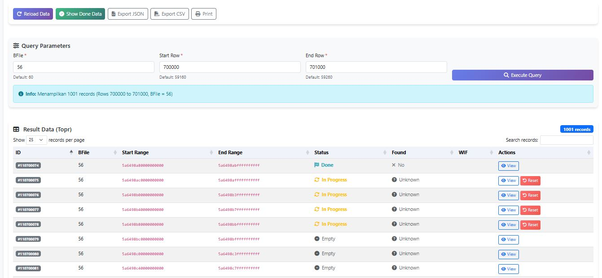
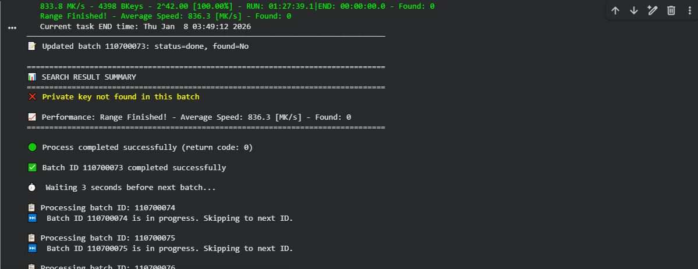

This project was built to overcome the limitations of GPU resources that may need to be turned off/or turned off by cloud services due to running out of usage credits, or the use of free cloud GPU services such as Colab or Lightning.ai where the user service only provides a time limit of a few hours, but don't worry, by using the tool from my project, you can continue searching for keys in the previously stopped range. You can reset the inprogress range ID if your GPU machine previously stopped while searching in that batch ID. If you are interested in my project, you can submit a request via WhatsApp: +6281553020811This project was built to overcome the limitations of GPU resources that may need to be turned off/or turned off by cloud services due to running out of usage credits, or the use of free cloud GPU services such as Colab or Lightning.ai where the user service only provides a time limit of a few hours, but don't worry, by using the tool from my project, you can continue searching for keys in the previously stopped range. You can reset the inprogress range ID if your GPU machine previously stopped while searching in that batch ID. If you are interested in my project, you can submit a request via WhatsApp: +6281553020811
#Pool Puzzle BTC #71

