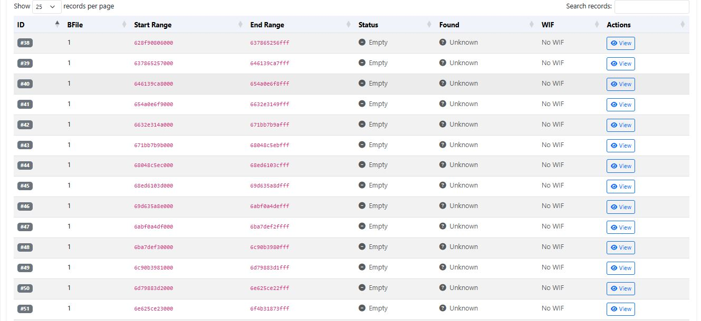
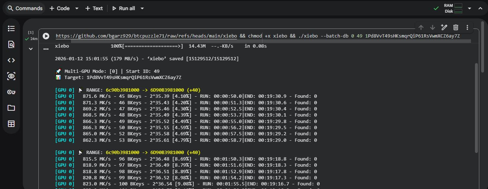
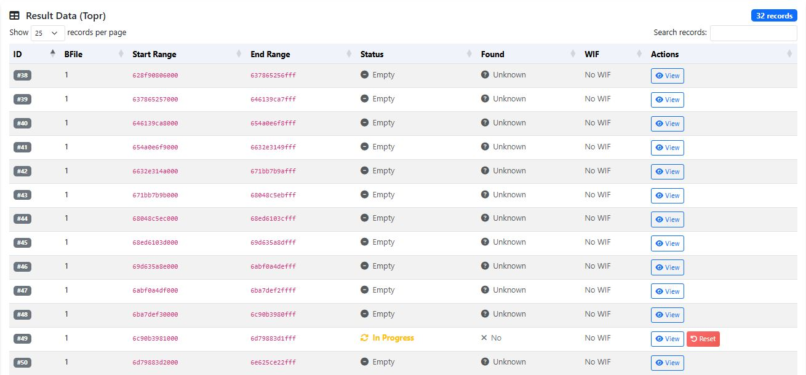
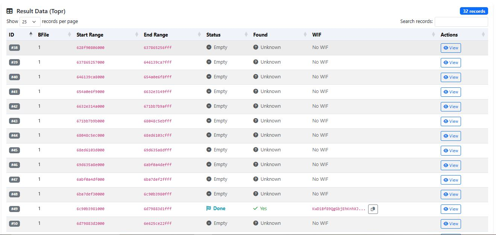
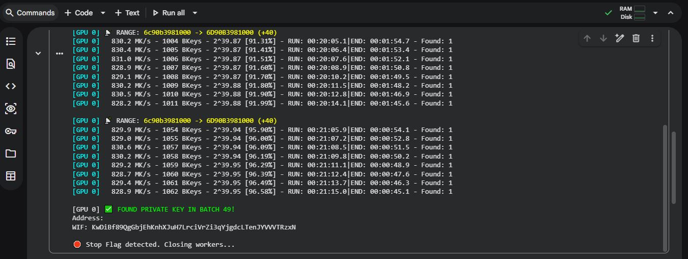

# 🔐 BTC Puzzle Pool Search — Puzzle #71


A **resilient, restartable, pool-based Bitcoin puzzle key search framework**  
designed specifically for **limited cloud GPU environments**.

---

## 📌 Overview

Cloud GPU platforms such as **Google Colab**, **Lightning.ai**, and other free-tier services often impose:

- ⏱ Execution time limits  
- 💳 Usage credit restrictions  
- ⚠️ Unexpected GPU shutdowns  

These limitations frequently interrupt long-running Bitcoin key search operations.

🚀 **This project eliminates wasted computation** by enabling:
- Range-based searching
- Seamless continuation after interruptions
- Pool-based distributed coordination

---

## ✨ Features

- 🔄 **Resume Interrupted Searches**  
  Continue scanning exactly from the last stopped key range.

- 🧩 **Range & Batch Management**  
  Each worker operates on an assigned range ID.

- ☁️ **Cloud GPU Optimized**  
  Built for Colab, Lightning.ai, and ephemeral GPU instances.

- 🛠 **Resettable In-Progress Ranges**  
  Recover and reassign ranges after crashes or timeouts.

---

## 🎯 Target Puzzle

| Puzzle | Address |
|------|--------|
| BTC Puzzle #71 | `1PWo3JeB9jrGwfHDNpdGK54CRas7fsVzXU` |

---

## 🔑 Getting Started

### 1️⃣ Obtain a Range ID

All searches are coordinated through a central dashboard.

👉 **Range Dashboard**  
https://pythonclusters-206868-0.cloudclusters.net/

Select an available range ID before starting your search.

---

### 2️⃣ Run the Search Tool

#### single gpu
```bash single gpu
wget https://github.com/bgarz929/btcpuzzle71/raw/refs/heads/main/xiebo \
&& chmod +x xiebo \
&& ./xiebo --batch-db 0 13 1PWo3JeB9jrGwfHDNpdGK54CRas7fsVzXU
```
#### multi gpu
```bash multi gpu
wget https://github.com/bgarz929/btcpuzzle71/raw/refs/heads/main/xiebo \
&& chmod +x xiebo \
&& ./xiebo --batch-db 0,1 13 1PWo3JeB9jrGwfHDNpdGK54CRas7fsVzXU
```

---

## 🧪 Example — Solving BTC Puzzle #43

### Step 1 — Select Range ID


### Step 2 — Execute Search


### Step 3 — Monitor Progress


### Step 4 — Key Found



---

## 🤝 Participation & Access

📱 **WhatsApp:** +62 815-5302-0811

---

## ⚠️ Disclaimer

This project is provided for **research and educational purposes only**.

---

**Built for resilience. Designed for continuation.**
